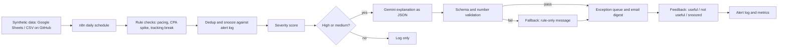

# Campaign Exception Triage
### Product case study, PRD and build plan (v0.1)

**Status: CONCEPT.** Nothing here is built, tested or validated yet. Use these labels throughout and update them honestly as work happens:

- **[Hypothesis]**: believed, not yet checked
- **[Decision]**: a choice made, with the reason recorded
- **[Simulated]**: result from synthetic data, not real users
- **[Observed]**: measured from something that really happened

All data is synthetic. No PGD or client data is used anywhere in this project.

---

## 0. Summary

Paid-media teams running many campaigns across markets often learn about budget pacing problems, cost spikes and broken conversion tracking late. The cost is wasted spend, corrupted reporting and awkward client conversations. **[Hypothesis]**

This product is not a dashboard. It is an **exception queue**: each morning it checks every live campaign, raises only the exceptions worth a human's attention, ranks them by money at risk, explains the likely cause, and learns from whether the person found the alert useful.

The product questions this project answers are:
- Which exceptions deserve attention, and which are noise?
- How do you avoid alert fatigue?
- When should an LLM help, and when should plain rules decide?

---

## 1. Problem framing

### 1.1 Problem statement
Campaign managers running multi-market paid media find pacing issues, cost spikes and tracking breaks late. Detection depends on someone opening the right dashboard at the right time, and native platform alerts are either too noisy or don't compare behaviour across campaigns. **[Hypothesis from my own domain experience; needs validation]**

### 1.2 Why it matters (the chain of reasoning to test)
1. Late detection means budget is under- or over-delivered, or conversions go unrecorded.
2. Unrecorded conversions corrupt optimisation and reporting, which hurts decisions beyond the single campaign.
3. Fixing problems late creates urgent rework and weakens client trust.
4. Teams then add manual checks, which take time that could go to optimisation.

Each link is a hypothesis. Section 1.5 says what would break the chain.

### 1.3 Existing alternatives (to research and verify before claiming gaps)

| Alternative | Why it might fall short **[Hypothesis]** | What to verify |
|---|---|---|
| Platform-native alerts and automated rules | Per-platform only, threshold-based, often noisy | What each platform actually alerts on today |
| BI dashboards with threshold alerts | Someone must build and maintain them for each client | How teams really use them |
| Manual daily or weekly check routines | Depend on attention and memory | How often checks are skipped |
| Scripts (for example Google Ads scripts) | Need coding skill to maintain | Who maintains them |
| Third-party monitoring tools | Cost, setup effort, fit | Current offerings and pricing, which I have not researched yet |

### 1.4 Discovery plan (5–8 conversations)
Talk to media practitioners **outside** any confidential client context, and discuss general experience, not client data. Use past-behaviour questions, not opinions about my idea:
1. Tell me about the last time a campaign went wrong and you found out late. What happened?
2. How did you find out, and how long after it started?
3. What do you check each morning, and what do you skip when busy?
4. Which alerts do you currently get, and which do you ignore? Why?
5. What did the problem cost you (time, spend, trust)?
6. What have you tried to fix it?

### 1.5 Hypotheses and kill criteria

| # | Hypothesis | Evidence that would invalidate it |
|---|---|---|
| H1 | Pacing issues are often found more than a day late | Most interviewees say they catch them within hours |
| H2 | Alert fatigue is a main reason existing alerts are ignored | People say they trust and act on native alerts |
| H3 | Tracking breaks are the costliest exception type | Nobody can name a tracking incident that mattered |
| H4 | Users want an explanation and a next step, not just more detection | Users say they only want a raw list |
| H5 | One set of thresholds can work across most campaigns | Every interviewee says thresholds differ completely per campaign |

**Kill rule [Decision]:** if H1 and H2 are both contradicted by most interviews, stop building and write up the finding as the case study. That is still a legitimate PM outcome.

---

## 2. Users and stakeholders

| Role | Relationship to the product | Cares about |
|---|---|---|
| Campaign manager (primary user) | Receives and acts on exceptions | Fewer surprises, clear next step, no noise |
| Team lead / media ops QA | Reviews exception queue and trends | Consistency, coverage, auditability |
| Account / client lead | Affected by outcomes, not a user | Avoiding client escalations |
| Head of media operations (buyer, if productised) | Would approve and pay | Time saved, risk reduced, cost |
| Data / analytics owner | Owns the source data | Data quality, no extra load |

**Stakeholder map [Decision]:** primary user and team lead are co-designers; account lead and data owner are consulted; the buyer is informed.

---

## 3. Jobs to be done and journey

**Core job:** "When I'm responsible for many live campaigns, I want to know which ones need action today and why, so I can fix problems before they cost money or trust."

**Supporting jobs:**
- Show me only what matters (control noise).
- Tell me what to check first (reduce diagnosis time).
- Let me tell the system when it was wrong (improve over time).

| Stage | Today **[Hypothesis]** | Target |
|---|---|---|
| Notice | Open dashboards, scan manually | Receive a ranked exception list |
| Understand | Dig through data to find the cause | Read a short factual summary with a likely-cause hint |
| Decide | Judge urgency from memory | Severity score based on money at risk |
| Act | Fix, then tell the team | Acknowledge, snooze or resolve in one place |
| Learn | Rarely recorded | Mark useful or not useful, which feeds tuning |

---

## 4. Strategy and metrics

**Vision:** nobody learns about a preventable campaign problem from a client.

**North Star:** share of true exceptions that are acknowledged within one working day. **[Simulated until real users exist]**

**Metrics tree**

| Level | Metric | Target (assumed, to tune) |
|---|---|---|
| North Star | True exceptions acknowledged within 1 working day | Define baseline after first simulation |
| Input | Detection precision (alerts that are real) | Aim above 70% **[Assumption]** |
| Input | Detection recall (real exceptions caught) | Aim above 85% **[Assumption]** |
| Input | Detection delay vs. a simulated manual weekly check | Lower is better |
| Guardrail | Alerts per campaign manager per day | At most 10 **[Assumption]** |
| Guardrail | Duplicate alert rate | Near zero after dedup |
| Guardrail | LLM explanations with numbers matching source data | 100% required |
| Guardrail | Running cost | £0 on free tiers |

**Baseline assumption [Hypothesis]:** the current process is a manual check at some cadence (for example daily or weekly). Confirm in discovery, and run the simulation against both.

---

## 5. Scope, prioritisation and trade-offs

### 5.1 RICE scoring (my estimates; edit when evidence changes)
Reach = campaigns affected per month out of 100 simulated. Impact on a 0.25–3 scale. Confidence 0–1. Effort in person-days.

| Feature | Reach | Impact | Conf. | Effort | RICE |
|---|---|---|---|---|---|
| F1 Pacing alert | 60 | 3 | 0.8 | 2 | 72 |
| F2 CPA spike alert | 40 | 2 | 0.7 | 3 | 18.7 |
| F3 Tracking-break alert | 15 | 3 | 0.8 | 2 | 18 |
| F4 Dedup and snooze | 100 | 2 | 0.8 | 2 | 80 |
| F5 Severity scoring | 100 | 2 | 0.7 | 2 | 70 |
| F6 Gemini explanation | 100 | 1 | 0.5 | 3 | 16.7 |
| F7 Feedback capture | 100 | 1 | 0.8 | 1 | 80 |
| F8 Weekly digest | 50 | 1 | 0.5 | 2 | 12.5 |
| F9 Config sheet (thresholds) | 100 | 1 | 0.8 | 1 | 80 |
| F10 ML anomaly detection | 60 | 2 | 0.3 | 8 | 4.5 |

**How to read this:**
- **RICE is not the build order.** Dedup (F4) and severity (F5) score high but depend on at least one detection rule existing first. Sequencing follows dependencies, not score alone.
- **F6 scores low on confidence.** The value of an LLM explanation is unproven, so it ships after the core and is tested before it earns its place.
- **F10 is deliberately last.** There is no labelled data, and a model nobody can explain is hard to trust.

### 5.2 MoSCoW for the MVP

| Priority | Features |
|---|---|
| Must | F1, F3, F4, F5, F7, F9 |
| Should | F2, F6 |
| Could | F8 |
| Won't (this version) | F10, multi-user accounts, real platform API connections, a UI beyond a sheet and email |

### 5.3 Explicit non-goals
- Not a reporting dashboard.
- No automatic changes to campaigns. The product only recommends.
- No real platform data or credentials.
- No claim of production readiness.

### 5.4 Decision log

| # | Decision | Alternatives | Reason | Revisit when |
|---|---|---|---|---|
| D1 | Rules first, ML later | ML anomaly detection from day one | Interpretable, no labelled data, faster to test | Enough feedback labels exist |
| D2 | LLM explains but never decides severity | LLM scores severity | Deterministic severity is auditable | Evaluation shows LLM scoring beats rules |
| D3 | Linear pacing (even spend per day) | Curve-based pacing | Simplest honest baseline | Front-loaded flights produce false alerts |
| D4 | Minimum-volume guards on CPA alerts | Alert on every deviation | Tiny volumes create noise | Misses real spikes |
| D5 | Daily batch | Real-time | Matches how teams work and fits free tiers | Users need faster detection |
| D6 | Escalate tracking breaks on day 2 | Alert once | Reduces one-day reporting glitches | Misses costly breaks |
| D7 | Add a 3-day run-rate pacing check alongside cumulative pacing | Cumulative pacing only | Cumulative ratios react slowly: a week of 50% overspend around day 40 moves the ratio by only about 9% | Run-rate check proves too noisy |

### 5.4a Trade-offs worth discussing in interviews
- **Precision vs. recall:** tight thresholds miss real problems; loose ones create noise. The product's job is to make that choice explicit and tunable.
- **Build vs. buy:** I'm building to learn and to demonstrate judgement. A real company would first test whether existing tools suffice.
- **Automation vs. trust:** recommend-only keeps humans accountable and lowers the cost of a wrong alert.

---

## 6. Product requirements (PRD)

### 6.1 User stories and acceptance criteria

**US1 Pacing exception.** As a campaign manager, I want to be alerted when a campaign's spend is off track so I can correct delivery.
- Given a live campaign and a report date, when spend-to-date divided by expected spend is below the lower or above the upper threshold, then an exception of type `pacing` is created.
- Campaigns outside their flight dates or paused are never flagged.
- The alert shows the ratio, spend, expected spend and days remaining.

**US2 Tracking break.** As a campaign manager, I want to know when conversions stop recording while traffic continues.
- Given clicks above the minimum and zero conversions on the report date, when conversions were recorded in the previous 7 days, then a `tracking` exception is created as Medium.
- If the same condition holds the next day, severity escalates to High.

**US3 Cost spike.** As a campaign manager, I want to see when cost per conversion jumps versus recent history.
- Given minimum conversion volumes today and over the prior 7 days, when today's CPA exceeds the baseline by the configured multiple, then a `cpa` exception is created.

**US4 No duplicates.** As a campaign manager, I don't want the same issue repeated daily.
- An open exception of the same campaign and type is updated, not duplicated.
- A snoozed exception stays silent until the snooze ends, unless severity rises.

**US5 Severity ranking.** As a team lead, I want the queue ordered by what matters most.
- Severity is derived from type, money at risk and days remaining using documented rules.
- Same input always gives the same severity.

**US6 Feedback.** As a campaign manager, I want to mark an alert useful or not useful.
- Feedback is stored against the alert with a timestamp.
- Weekly precision is computed from this feedback.

**US7 Explanation (Should).** As a campaign manager, I want a short factual summary and next step.
- Output is valid JSON with fixed fields.
- Every number in the text matches the source data.
- Causes are phrased as possibilities, never as facts.

### 6.2 Non-functional requirements
- Runs once per day without manual steps.
- A failure in one check never blocks the others.
- If the LLM fails, the rule-based alert is still sent.
- Every alert and every rule decision is logged.
- Thresholds live in a config sheet, not in workflow code.

### 6.3 Edge cases to test
Zero spend; campaign starting today; campaign ending today; paused campaign; missing day of data; duplicate rows; zero conversions with zero clicks; very low volumes; timezone and date boundaries; currency differences; budget changed mid-flight.

### 6.4 Dependencies and assumptions
- A stable data file or sheet format for daily performance.
- Free-tier availability of n8n and the Gemini API **[verify limits before relying on them]**.
- Assumption: linear pacing is acceptable (see D3).

### 6.5 Risks

| Risk | Likelihood | Mitigation |
|---|---|---|
| Alert fatigue makes the product ignorable | High | Dedup, severity, caps, feedback |
| Synthetic data hides real-world messiness | High | State limits plainly; list edge cases; ask practitioners to review |
| LLM invents causes | Medium | Facts-only prompt, number check, fallback |
| Scope creep | Medium | MoSCoW, weekly scope check |
| Free tier limits change | Medium | Keep rules independent of the LLM |

### 6.6 Open questions
- What pacing tolerance do practitioners actually use?
- Which exception type is costliest in practice?
- Do users want email, chat or a sheet as the main surface?

---

## 7. Instrumentation and experimentation

### 7.1 Event tracking plan

| Event | When | Key fields |
|---|---|---|
| `exception_created` | Rule fires | exception_id, campaign_id, type, severity, created_at |
| `exception_sent` | Delivered | exception_id, channel, sent_at |
| `exception_acknowledged` | User confirms | exception_id, user, ack_at |
| `exception_feedback` | Marked useful or not | exception_id, label, reason |
| `exception_snoozed` | Snoozed | exception_id, until_date |
| `exception_resolved` | Closed | exception_id, resolved_at, resolution |

### 7.2 Evaluation on synthetic data **[Simulated]**
1. Generate about 30 campaigns over 60 days.
2. Inject about 25 known anomalies and record them in a truth table (`anomaly_truth`).
3. Run the rules over the data.
4. Count an alert as a true positive when it matches a truth row by campaign and type within its date window.
5. Report precision, recall, alerts per week and detection delay.
6. Compare delay against a simulated manual weekly check.

### 7.3 Threshold sensitivity analysis **[Simulated]**
Run the same data at three pacing tolerances (for example ±10%, ±15%, ±20%) and compare precision, recall and alert volume. This is an offline sensitivity test, not an A/B test, and must be labelled that way.

### 7.4 How this would work with real users
A shadow-mode launch (alerts logged, not sent), then a pilot with one team, then wider rollout, using the config sheet's `enabled` column as a simple feature flag. Success is judged by acknowledged-within-SLA and by feedback precision.

### 7.5 What would reject the product hypothesis
- Precision stays below the target even after tuning.
- Users in the pilot ignore the queue.
- Existing tools already catch these exceptions within hours.

---

## 8. Technical design

### 8.1 Architecture and data flow



### 8.2 Data model

| Table | Key fields |
|---|---|
| `campaigns` | campaign_id, name, market, platform, budget_total, start_date, end_date, status |
| `daily_performance` | campaign_id, report_date, spend, impressions, clicks, conversions |
| `anomaly_truth` | anomaly_id, campaign_id, type, start_date, end_date (for evaluation only) |
| `config` | rule, threshold, min_volume, enabled |
| `exceptions` | exception_id, campaign_id, type, severity, status, created_at, details |
| `feedback` | exception_id, label, reason, created_at |

### 8.3 Building the synthetic data (low-code)
Generate it in Google Sheets using simple formulas with random variation, then add the anomalies by hand and record each one in `anomaly_truth`. This keeps the data explainable, and you can describe in an interview exactly how it was made. If you use AI Studio to help, you must be able to explain every step. Do not paste in anything you cannot maintain.

### 8.4 SQL rules (Postgres-style; replace `:as_of_date` with a date value)

**Pacing ratio (linear pacing)**
```sql
WITH spend AS (
  SELECT campaign_id, SUM(spend) AS spend_to_date
  FROM daily_performance
  WHERE report_date <= :as_of_date
  GROUP BY campaign_id
)
SELECT c.campaign_id,
       s.spend_to_date,
       c.budget_total * ((:as_of_date - c.start_date + 1)::numeric
                         / (c.end_date - c.start_date + 1)) AS expected_spend,
       s.spend_to_date / NULLIF(
         c.budget_total * ((:as_of_date - c.start_date + 1)::numeric
                           / (c.end_date - c.start_date + 1)), 0) AS pacing_ratio
FROM campaigns c
JOIN spend s USING (campaign_id)
WHERE :as_of_date BETWEEN c.start_date AND c.end_date
  AND c.status = 'live';
```

**Run-rate pacing (last 3 days vs. planned daily spend)**

The cumulative ratio above reacts slowly to a recent change, so this check compares recent daily spend with the plan (see decision D7).
```sql
SELECT c.campaign_id,
       AVG(d.spend) AS recent_daily_spend,
       c.budget_total::numeric / (c.end_date - c.start_date + 1) AS planned_daily_spend,
       AVG(d.spend) / (c.budget_total::numeric
                       / (c.end_date - c.start_date + 1)) AS run_rate_ratio
FROM daily_performance d
JOIN campaigns c USING (campaign_id)
WHERE d.report_date BETWEEN :as_of_date - 2 AND :as_of_date
  AND :as_of_date BETWEEN c.start_date AND c.end_date
  AND c.status = 'live'
GROUP BY c.campaign_id, c.budget_total, c.start_date, c.end_date;
```

**CPA spike against the prior 7 days**
```sql
WITH daily AS (
  SELECT campaign_id, report_date, spend, conversions,
         SUM(spend)       OVER w AS spend_prev7,
         SUM(conversions) OVER w AS conv_prev7
  FROM daily_performance
  WINDOW w AS (PARTITION BY campaign_id ORDER BY report_date
               ROWS BETWEEN 7 PRECEDING AND 1 PRECEDING)
)
SELECT campaign_id, report_date,
       spend / NULLIF(conversions, 0)      AS cpa_today,
       spend_prev7 / NULLIF(conv_prev7, 0) AS cpa_baseline
FROM daily
WHERE report_date = :as_of_date
  AND conversions >= 5
  AND conv_prev7 >= 20
  AND spend / conversions > 1.5 * (spend_prev7 / conv_prev7);
```

**Tracking break**
```sql
SELECT d.campaign_id, d.report_date, d.clicks, d.conversions
FROM daily_performance d
WHERE d.report_date = :as_of_date
  AND d.clicks >= 200
  AND d.conversions = 0
  AND EXISTS (
    SELECT 1 FROM daily_performance p
    WHERE p.campaign_id = d.campaign_id
      AND p.report_date BETWEEN :as_of_date - 7 AND :as_of_date - 1
      AND p.conversions > 0
  );
```

The numbers (0.85/1.15 tolerance, 1.5×, 5 and 20 conversions, 200 clicks) are **starting assumptions** stored in the config sheet and tuned in section 7.3.

### 8.5 n8n workflow design
1. **Schedule trigger:** daily.
2. **Read** config and data.
3. **Run each check** as a separate branch so one failure does not stop the others.
4. **Dedup** against open exceptions.
5. **Score severity** with documented rules (type, money at risk, days remaining).
6. **Gemini step** (only for High and Medium).
7. **Validate** JSON schema and that every number matches the source.
8. **Deliver** to the exception queue and an email digest.
9. **Log everything.**
10. **Error workflow:** a separate trigger that notifies on failure.

**Reliability:** use retry-on-fail with a delay for external calls, and a fallback message when the LLM fails. Write down which parts you tested by forcing failures.

### 8.6 Gemini design (Google AI Studio)
- Prototype and refine the prompt in AI Studio, then call the API from n8n.
- Input: structured facts only (campaign, type, numbers, dates).
- Output: JSON with `summary`, `possible_causes`, `first_checks`, `confidence`.
- Rules: no invented numbers, causes phrased as possibilities, no instructions that change campaigns.
- **Evaluation:** build 30 labelled cases and check schema validity, number accuracy (100% required), tone, and whether a next step is present. Record results as **[Simulated]**.

### 8.7 Security and privacy
- Synthetic data only; no personal data.
- Keep API keys in n8n credentials, never in the repo.
- Add a `.gitignore` for secrets and local config.
- Note that free LLM tiers can have different data-use terms from paid tiers. **Verify before use**, even with synthetic data.

### 8.8 Free-tool notes (verify before relying on them)
- **n8n:** self-hosting the community edition is free but needs somewhere to run it; a laptop that is off will miss a daily schedule. Cloud plans are typically trials or paid.
- **Gemini API:** free tier has rate and usage limits.
- **Optional Postgres (for example Supabase free tier):** check limits and inactivity behaviour.
- **GitHub:** free for public repos; GitHub Actions can run simple tests.

If any limit blocks the plan, the fallback is to run the workflow manually on demand and say so honestly in the case study.

---

## 9. Delivery plan

### 9.1 Roadmap

| Horizon | Scope |
|---|---|
| Now (weeks 1–5) | MVP: F1, F3, F4, F5, F7, F9, then F2 and F6 |
| Next | Weekly digest, config UI prototype in AI Studio, optional Postgres |
| Later | ML baselines, multi-platform inputs, multi-user |

**Dependencies:** data format, then rules, then dedup, then severity, then LLM, then feedback loop.

### 9.2 Sprint plan (assumes about 15 hours a week, including about 5 hours of weekday SQL practice)

| Week | Goal | Deliverables |
|---|---|---|
| 1 | Discovery and framing | Interview notes, hypotheses table, metrics tree, one-page PRD v1 |
| 2 | Data and SQL | Synthetic dataset, truth table, three SQL rules passing fixture tests |
| 3 | n8n v1 | Workflow with dedup, severity, logging, config sheet |
| 4 | Gemini, feedback, reliability | Evaluated prompt, fallback, error workflow, feedback capture |
| 5 | Test and publish | Test log, simulated results, sensitivity analysis, case study, demo video |

**Fallbacks:**
- If week 3 slips, drop F6 and ship Gemini as v1.1.
- If n8n hosting blocks the schedule, run manually and document it.
- If interviews are hard to get, say so and rely on clearly labelled hypotheses, not invented findings.

### 9.3 Launch and feedback
- Publish a public repo, a case study and a short demo recording.
- Ask 3–5 practitioners to review the case study and the exception outputs, and record what they say.
- Run a retrospective after launch: what worked, what didn't, what you would change.

### 9.4 Working rituals to simulate (alone, but written down)
- Weekly stakeholder update (what shipped, what's next, risks, decisions needed).
- Backlog refinement before each sprint, and a definition of done for every story.
- A short retro each week.
- One simulated incident (for example a false-alert storm) with a written postmortem.

---

## 10. PM concepts covered, and where they live

| PM concept | Where it appears | Artifact |
|---|---|---|
| Customer discovery | Section 1.4 | Interview notes |
| Problem framing | Section 1.1–1.2 | Problem statement |
| Hypotheses and kill criteria | Section 1.5 | Hypotheses table |
| Competitive analysis | Section 1.3 | Alternatives table |
| Personas and stakeholder mapping | Section 2 | Stakeholder table |
| Jobs to be done | Section 3 | JTBD statements |
| User journey mapping | Section 3 | Journey table |
| Vision and strategy | Section 4 | Vision statement |
| North Star and metrics tree | Section 4 | Metrics tree |
| Guardrail metrics | Section 4 | Guardrails |
| Opportunity assessment | Sections 1, 5 | RICE, assumptions |
| Prioritisation (RICE, MoSCoW) | Section 5 | Scoring table |
| Dependency vs. score-based sequencing | Section 5.1 | Reading notes |
| Trade-off analysis | Section 5.4a | Decision log |
| Build vs. buy | Section 5.4a | Decision log |
| MVP and non-goals | Section 5.2–5.3 | Scope list |
| PRD, user stories, acceptance criteria | Section 6 | PRD |
| Edge cases and non-functional needs | Section 6.2–6.3 | Test list |
| Risk management | Section 6.5 | Risk table |
| Assumptions and open questions | Section 6.4, 6.6 | Lists |
| Analytics instrumentation | Section 7.1 | Event plan |
| Experimentation and sensitivity analysis | Section 7.2–7.3 | Evaluation report |
| Staged rollout and feature flags | Section 7.4 | Rollout plan |
| Technical design and data model | Section 8 | Architecture, schema |
| Working with engineering constraints | Section 8.8 | Free-tool notes |
| Reliability, logging, error handling | Section 8.5 | Error workflow |
| Security and privacy | Section 8.7 | Controls list |
| AI/LLM product judgement | Sections 5.4, 8.6 | D2, evaluation |
| QA and test planning | Sections 6.3, 9.2 | Test log |
| Roadmapping (now / next / later) | Section 9.1 | Roadmap |
| Agile rituals and definition of done | Section 9.4 | Updates, retros |
| Launch and go-to-market | Section 9.3 | Launch plan |
| Incident response and postmortem | Section 9.4 | Postmortem |
| Feedback loops and iteration | Sections 7, 9.3 | Retro, feedback data |
| Stakeholder communication | Section 9.4 | Weekly update |
| Decision documentation | Section 5.4 | Decision log |
| Unit economics and cost awareness | Sections 4, 8.8 | Cost guardrail |

---

## 11. Hiring relevance and honesty checks

**What this demonstrates:** problem framing, prioritisation, metrics design, PRD writing, experimentation thinking, SQL, workflow automation, AI product judgement, reliability thinking, written communication.

**What it does not demonstrate:**
- Real users or real demand
- Engineering team collaboration
- A production launch or revenue
- Large-scale data handling

Say this openly in the case study. It makes the rest more credible.

**Interview questions to prepare**
1. Why this problem, and what evidence do you have?
2. How did you choose your thresholds?
3. Why rules and not ML?
4. How do you know the alerts are good, and what are the limits of your synthetic test?
5. Tell me about the hardest trade-off you made.
6. What would you do differently with real users?
7. How would you roll this out to a team?
8. What would make you kill it?
9. Walk me through how the workflow fails and recovers.
10. How would you decide whether to build or buy?

**Proof required before claiming "completed"**
- [ ] Repo with README, data dictionary, SQL, workflow export and decision log
- [ ] Test log with fixture tests and forced-failure tests
- [ ] Simulated results clearly labelled, with limitations
- [ ] Demo recording of the workflow running
- [ ] Case study following the ten-part structure
- [ ] At least a few practitioner conversations recorded, or a plain statement that none happened
